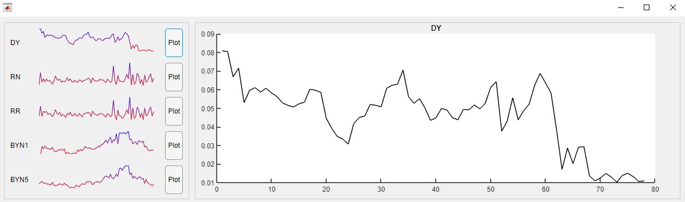

# Sparklines Component

Version: 1.0

This component creates small graphs which show the general trend of the data in each row/column. Sparklines are meant to summarize data in a concise and easy-to-understand way, such that in e.g. a table, data trends for each row/column can be quickly observed and compared.



## Syntax
* `sparklinesComponent('Data', data)` create a ui component which creates sparklines for each row in `data`. The sparklines are by default stacked in a column.
* `sparklinesComponent(___,Name,Value)` specifies additional options for the sparkline component using one or more name-value pair arguments. Specify the options after all other input arguments.
* `sparklinesComponent(parent,___)` create the sparkline component in the specified ui parent (e.g. uifigure, uigridlayout, etc.).
* `h = sparklinesComponent(___)` returns the sparklineComponent object. Use h to modify properties of the component after creating it.

## Name-Value Pair Arguments/Properties
* `Data` (n x m numeric matrix) matrix which contains the data used to create the sparklines.
* `DataOrientation` (string) string describing whether a sparkline is created for each row (`'row'`) or for each column (`'column'`).
* `SparklinesOrientation` (string) string describing whether the sparklines are stacked in a column (`'col'`) or are arranged side-by-side in a row (`'row'`). 
* `ColorMode` (string) string describing whether the sparklines are one solid color (`'solid'`) or use a gradient based on minimum and maximum values in Data (`'gradient'`).
* `LineColor` (1 x 3 numeric vector) RGB triple to use for sparklines if ColorMode is `'solid'`.
* `LimitColors` (2 x 3 numeric matrix) A pair of RGB triples to use as the minimum and maximum colors of the sparklines' color gradient corresponding to the minimum and maximum values in Data if ColorMode is `'gradient'`. 
* `LineWidth` (double) line width of the sparklines.
* `SparklineStyle` (string) string describing the line style of the sparklines (`'line'`, `'dotted'`, `'dashed'`, `'bar'`).

## Example
Generate a matrix of normal data. Create sparklines for the rows of the matrix, which is how sparklines are created by default. 
```
normalDist = makedist('Normal', 'mu', 0, 'sigma', 1);
Data = random(normalDist, 10, 10);
 
f = uifigure;
h = sparklinesComponent(f, 'Data', Data);
```
